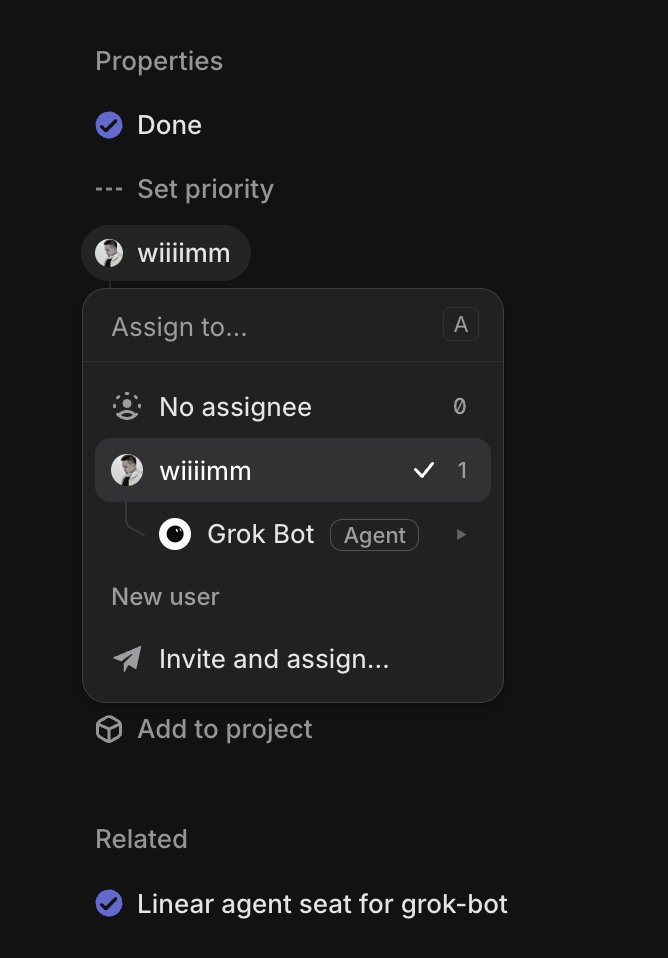
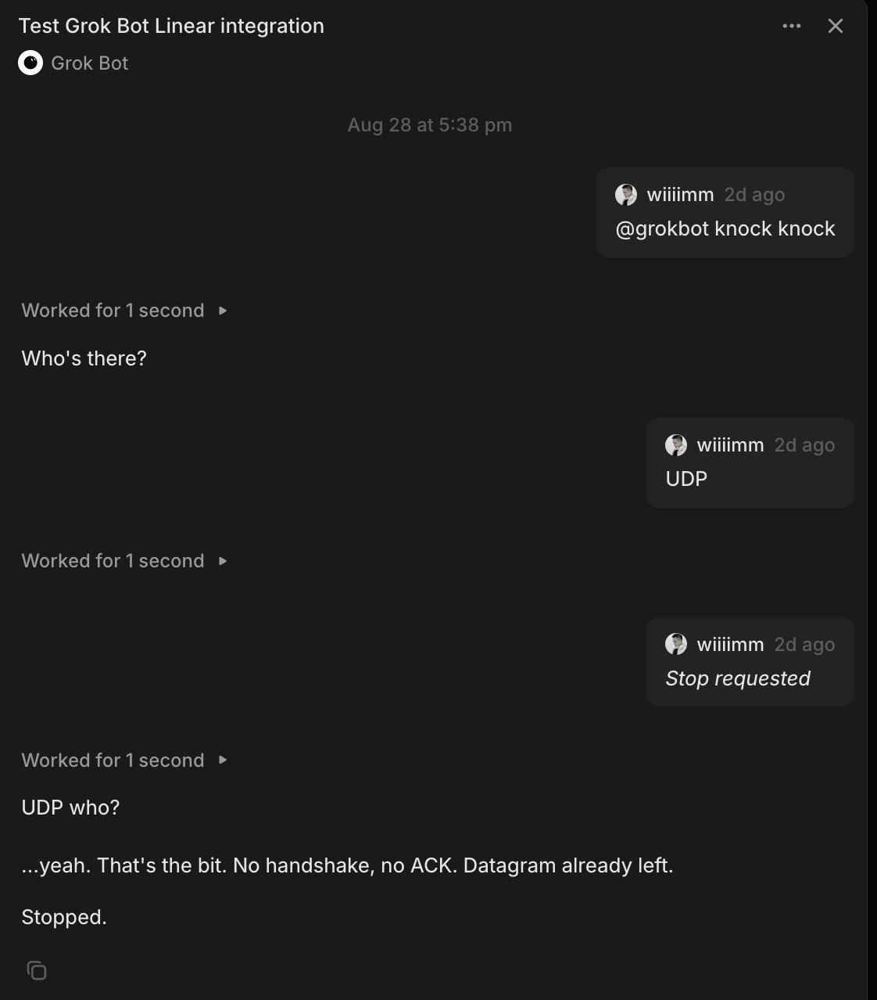
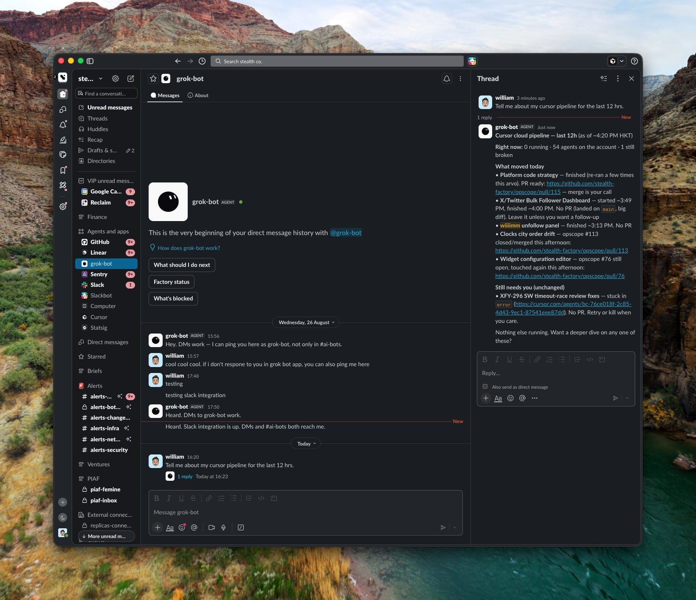

# grok-bot proxies

Public HTTPS hops between the services Grok Bot lives in and the Cursor webhooks that run it —
plus the outbound hops that let a run write back.

No platform here can talk to Cursor directly. Slack cannot send an `Authorization` header and
demands a challenge echo. Linear signs its deliveries, wants a 200 inside 5 seconds, and — for
agents — expects replies out-of-band through its GraphQL API rather than in the webhook
response. Each service gets a hop that speaks its dialect on one side and Cursor's on the other.

Production: `https://grok-bot-proxies.alt-x.systems` · Deployed on Vercel (`main` → production)

```
   platform                    this proxy                       Cursor
  ──────────                  ────────────                     ────────
   webhook  ─────────────────► verify signature
                               acknowledge, if the platform
                                 demands one on a deadline
                               forward the raw payload ───────► run starts
                                                                    │
   platform ◄───────────────── write back as the app ◄──────────────┘
     UI                        (where an outbound route exists)
```

Inbound is the same everywhere. Outbound is where services differ: Linear has relay routes so
runs hold no credentials, Slack does not yet.

## What it looks like

| Assign it                                                                                                              | Talk to it                                                                                                                      | In Slack                                                                                                    |
| ---------------------------------------------------------------------------------------------------------------------- | ------------------------------------------------------------------------------------------------------------------------------- | ----------------------------------------------------------------------------------------------------------- |
|  |  |  |
| Delegate an issue to **Grok Bot**, badged `Agent`                                                                      | It answers in the session, turn by turn                                                                                         | DM or @mention it, badged `AGENT`                                                                           |

## Services

| Service    | Inbound        | Outbound                                        | Guide                            |
| ---------- | -------------- | ----------------------------------------------- | -------------------------------- |
| **Linear** | `POST /linear` | `POST /linear/activity`, `POST /linear/comment` | [docs/linear.md](docs/linear.md) |
| **Slack**  | `POST /slack`  | — runs call Slack's API directly                | [docs/slack.md](docs/slack.md)   |

Adding another? [docs/adding-a-service.md](docs/adding-a-service.md) is the checklist and the
decisions worth making deliberately.

## Guides

|                                              |                                                                                 |
| -------------------------------------------- | ------------------------------------------------------------------------------- |
| [Linear](docs/linear.md)                     | App creation, `actor=app` install, agent sessions, replying, gotchas            |
| [Slack](docs/slack.md)                       | Event Subscriptions, the challenge echo, and why there is no outbound route yet |
| [Operations](docs/operations.md)             | Environment, deploying, logging, local dev, tests                               |
| [Adding a service](docs/adding-a-service.md) | The shape every service follows, and the per-service decisions                  |

## All routes

| Route                   | Handler                  | Service                          |
| ----------------------- | ------------------------ | -------------------------------- |
| `GET /`                 | `api/index.ts`           | — landing page. `POST /` is 404. |
| `GET,HEAD,POST /slack`  | `api/slack.ts`           | Slack                            |
| `GET,HEAD,POST /linear` | `api/linear.ts`          | Linear                           |
| `GET /linear/callback`  | `api/linear-callback.ts` | Linear                           |
| `POST /linear/activity` | `api/linear-activity.ts` | Linear                           |
| `POST /linear/comment`  | `api/linear-comment.ts`  | Linear                           |

`/api/webhooks/slack` and `/api/webhooks/linear` are aliases of `/slack` and `/linear`.

## Agent skills

`skills/` holds the specs the Cursor run reads, not documentation for this repo:

| Skill                | Use                                                           |
| -------------------- | ------------------------------------------------------------- |
| `linear-agent-reply` | Reply into Linear — session activities or an ordinary comment |
| `slack-agent-reply`  | Reply to a Slack mention or DM                                |

They differ in one important way. The Linear skill writes **through this proxy**, which holds
the credentials, so the run needs none. Slack has no outbound route, so that skill calls
Slack's Web API directly and the run needs its own `SLACK_BOT_TOKEN` — which also puts the
loop guard on the run rather than in the proxy.

## Quick start

```bash
npm install
cp .env.example .env.local   # your own values; never commit
npm test
npx vercel --prod
```

Then follow the guide for the service you are wiring up. Env vars and the redeploy rule are in
[Operations](docs/operations.md).

## Layout

```
api/      one self-contained handler per route — no imports between them, deliberately
docs/     per-service guides and shared operations
skills/   specs for the agent run, one per service
test/     vitest, one spec per handler
```

## Credits

Built by [stealth factory](https://www.stealth-factory.co).
Contributor: [@wiiiimm](https://x.com/wiiiimm).

## License

MIT — see [LICENSE](LICENSE).
